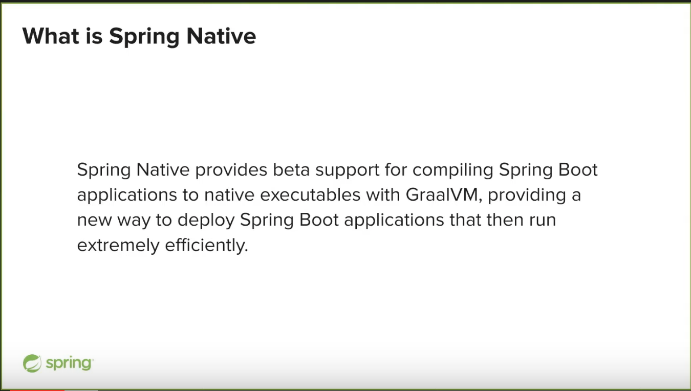
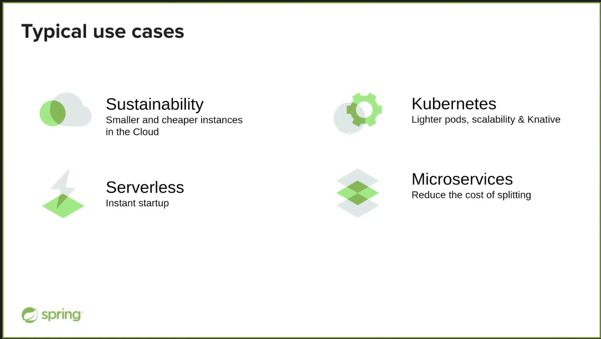

# springone-2021-highlights
Notes about my personal highlights of SpringOne 2021

### General observations

Find all video-recordings at https://springone.io/2021/schedule (you need to create an account, but most are also on Youtube)

* 

---

### Spring Boot & GraalVM Current Status

__*"Spring Native"*__ by https://twitter.com/sdeleuze

https://github.com/spring-projects-experimental/spring-native

JVM & native comparison / tradeoffs:

JVM: more runtime optimizations!

native: memory & startup time!

##### Spring Native Beta (March 2021):

https://spring.io/blog/2021/03/11/announcing-spring-native-beta

> While it is still considered as experimental, beta means that Spring now provides support for native on a subset of the Spring ecosystem. You can try it on your projects if they are using the supported dependencies and raise bugs or contribute pull requests if something goes wrong. A new release of Spring Native will happen for each patch release of the latest Spring Boot 2.x minor version. Spring Native 0.9.0 supports Spring Boot 2.4.3, Spring Native 0.9.1 will support Spring Boot 2.4.4, etc. Breaking changes will happen but we will document migration paths.

or 2.5.x: https://docs.spring.io/spring-native/docs/current/reference/htmlsingle/index.html#_validate_spring_boot_version

> Spring Native 0.10.5 only supports Spring Boot 2.5.6, so change the version if necessary. 

##### @NativeHint

> Some native configuration can not be inferred, for those cases we are introducing native hint annotations (see the Javadoc for more details) which allows Spring Native to support native configuration in a more maintainable, typesafe and flexible way than regular JSON based native image configuration.

New from 0.11 on: 

##### Enhanced Spring AOT

https://spring.io/blog/2021/03/11/announcing-spring-native-beta

##### Native testing with JUnit

JUnit testing native: test the native image support with JUnit 5

No Mockito support right now.

##### Docs

https://docs.spring.io/spring-native/docs/current/reference/htmlsingle/index.html#overview

##### Samples!

https://github.com/spring-projects-experimental/spring-native/tree/main/samples

__--> More details: https://github.com/jonashackt/springone-2020-highlights#spring-boot--graalvm__

https://github.com/jonashackt/spring-boot-graalvm

https://blog.codecentric.de/en/2020/05/spring-boot-graalvm/

---
